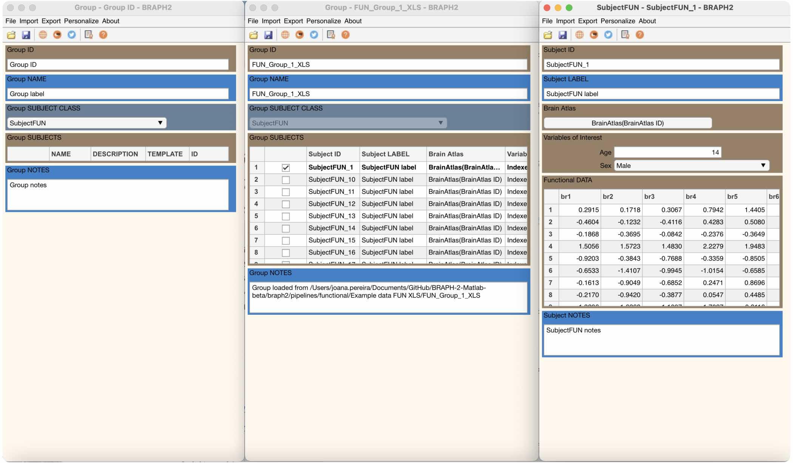
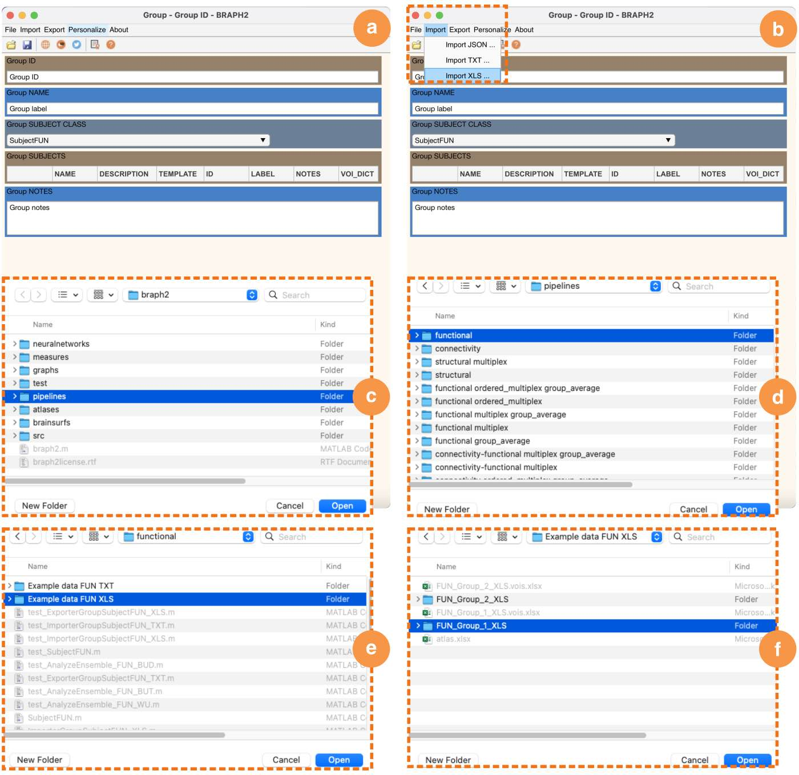
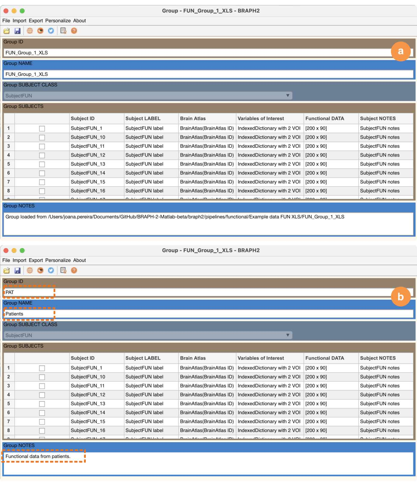
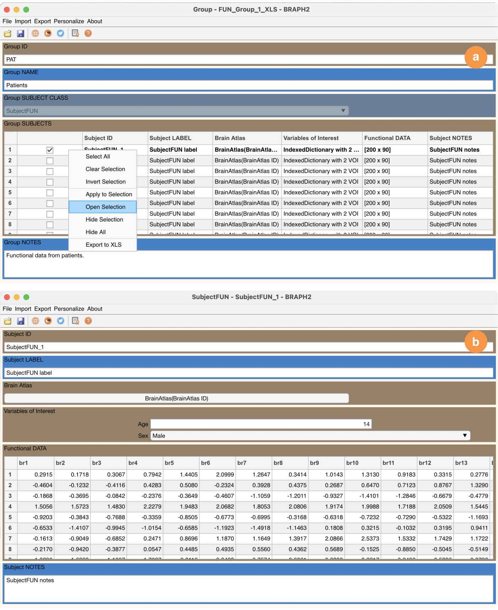
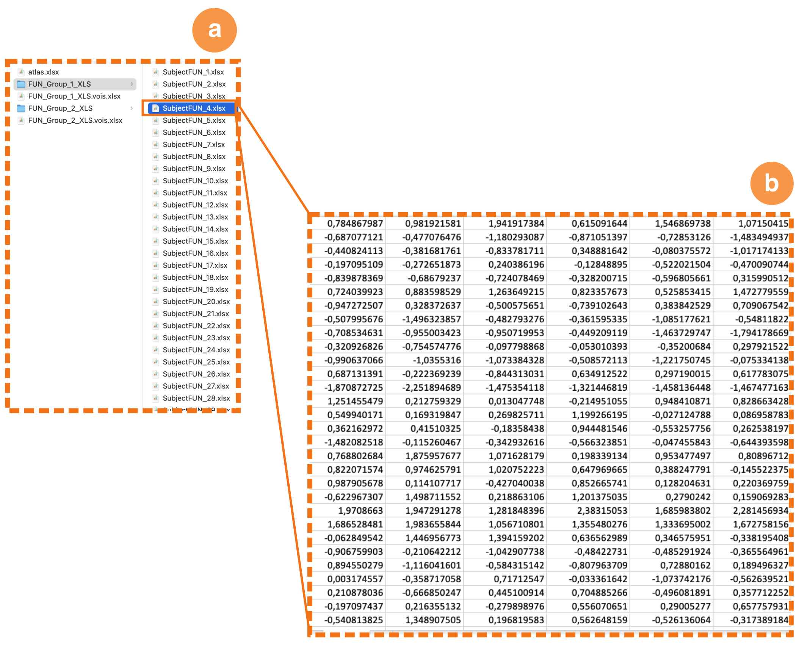
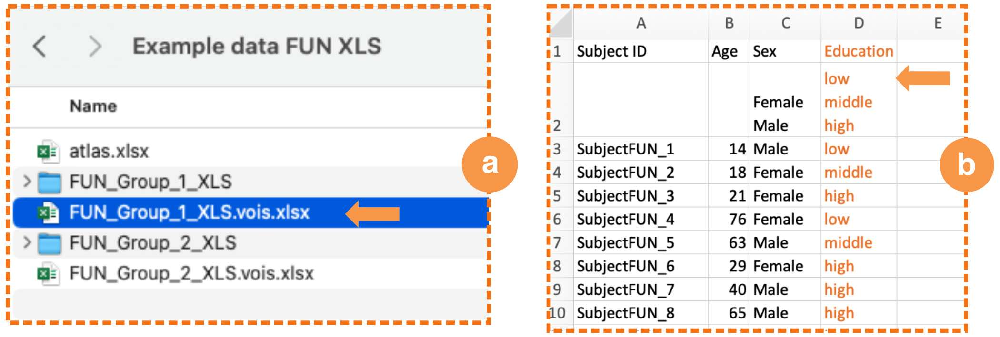

# Group of Subjects with Functional Data

[](tut_gr_fun.pdf)

For *functional data*, we will upload a folder containing the functional files for different subjects that belong to the same group. For example, the functional values could correspond to brain activation signals derived from functional MRI data. Then a connectivity matrix is computed using correlations in functional values between each pair of brain regions. 
This Tutorial explains how to prepare and work with this kind of data.

> 
> 
> **Figure 1. GUI for a group of subjects with functional data.**
> Full graphical user interface to upload a group of subjects with functional data in BRAPH 2.0.

## Open the GUI

In most analyses, the group GUI is the second step after you have selected a brain atlas. You can open it by typing `braph2` in MatLab's terminal, which allows you to select a pipeline containing the steps required to perform your analysis and upload a brain atlas. After these steps have been completed you can upload your group's data directly (Figure 2c-f) after clicking "Load Group". You can also open the GUI and upload the brain functional data using the command line (i.e., without opening an analysis pipeline) by typing the commands referenced below. In that case, you can upload the data as shown in Figure 2a-f.

> 
> 
> **Figure 2. Upload the data of a group of subjects.**
> Steps to upload a group of subjects with functional data using the GUI and an example dataset:
> **a** Open the group GUI.
> **b** Import a folder containing the functional files in XLS or TXT format (see below for details on their format).
> To upload the test functional data:
> **c-f** navigate to the BRAPH 2.0 folder `pipelines`, **d** `functional`, **e** `Example data FUN XLS`, and **f** select the folder containing the functional values of one group `FUN_Group_1_XLS`.
 
Commands to open the GUI and upload the brain functional data:

```matlab
gr = Group('SUB_CLASS', 'SubjectFUN');  % creates a new object Group to use functional values for assessing connectivity i.e., SubjectFUN.

gui = GUIElement('PE', gr);  % creates a GUI to upload the group data.
gui.get('DRAW');  % draws the GUI.
gui.get('SHOW');  % shows the GUI.
```

Moreover, if you don't have the `Example data FUN XLS` folder inside `functional`, then you can generate it by running the commands referenced below.

```matlab
test_ImporterGroupSubjectFUN_XLS  % generates the example functional XLS data folder.
test_ImporterGroupSubjectFUN_TXT  % generates the example functional TXT data folder.
```

## Visualize the Group Data

After completing the steps described in the Figure 2, you can see the data as shown in Figure 3a, and change the Group ID, name, and notes as in Figure 3b.

> 
> 
> **Figure 3. Edit the group metadata.** 
> **a** The GUI of the group's functional data.
> **b** The information you see on this GUI that can be changed. In this example, we have edited the ID, name, and notes of the group but can also change the subject's specific information.

## Visualize Each Subject's Data

Finally, you can open each subject's functional values by selecting the subject, right-click, and select "Open selection" as shown in Figure 4a, which shows the functional values in Figure 4b. Here, you can also change the subject's metadata (ID, label, notes), its variables of interest, and the functional values.

> 
> 
> **Figure 4. Edit the individual subject data.** 
> **a** Each subject's functional values can be opened by selecting the subject,  right-click, and select "Open selection".
> **b** In this subject GUI, it is possible to view and edit the metadata of the subject (ID, label, notes), its variables of interest (in this case, age and sex), and the functional values. 

## Preparation of the Data to be Imported

To be able to import functional data into BRAPH 2.0, you need to include the functional values in a separate file for each subject in excel or text format. Below you can see how this file should look like.

> 
>
> **Figure 5. Data preparation.**
> The data organization should follow this format:
> **a** The functional values from each subject should be included in a separate file (for example, FUN_Group_1_xlsx). 
> **b** This file should contain the functional values for each brain region belonging to a brain atlas. In this example, the (simulated) values correspond to brain activation signals of 90 brain regions derived from functional MRI.
 
## Adding Covariates

When analyzing data, it's a common practice to incorporate *variables of interest*, which can be *covariates* or *correlates*. In BRAPH 2.0, these variables of interest must be stored in a separate excel file located just outside the group's folder. The file should share the group folder's name, but with a `.vois` extension, as shown in Figure 6a. The file must adhere to a specific format outlined in Figure 6b:

- **Subject IDs (column A).** Starting from row 3, column A should list the subject IDs.
  
- **Variables of interest (column B and subsequent columns).** Column B and the following columns should contain the variables of interest, one per column. Using this example, we see variables like "Age" and "Sex", along with an additional "Education" variable. For each column:
  - Row 1: The name of the variable of interest.
  - Row 2: Categories separated by a return (only for categorical variables of interest, like "Sex" and "Education").
  - Subsequent rows: The values of the variable of interest for each subject.

> 
>
> **Figure 6. Edit the Covariates.**
> The editable information in the Covariates file includes:
> **a** The names of the variables of interest (vois).
> **b** For categorical vois, you can specify the categories they belong to.

