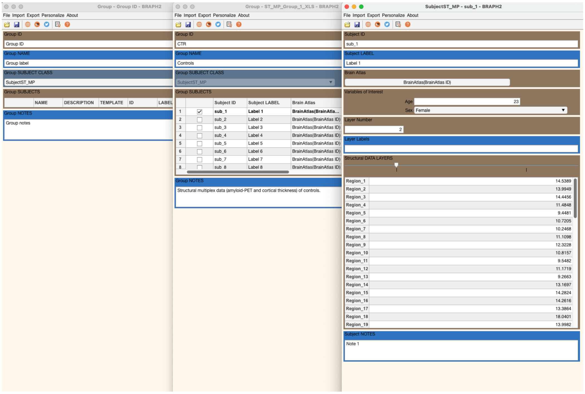
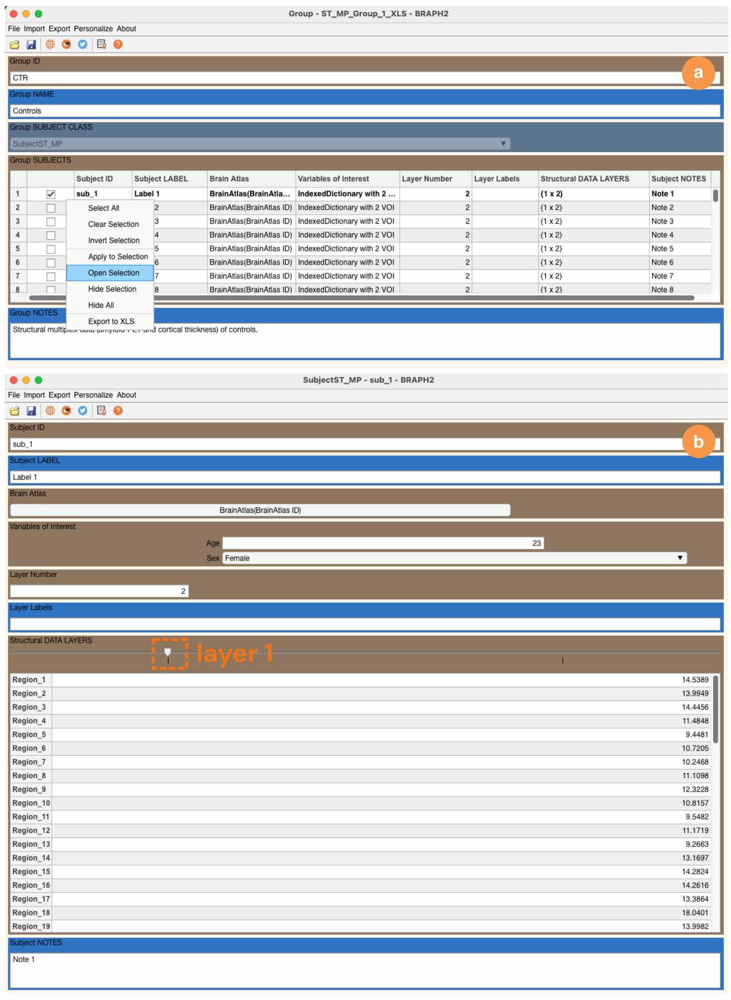
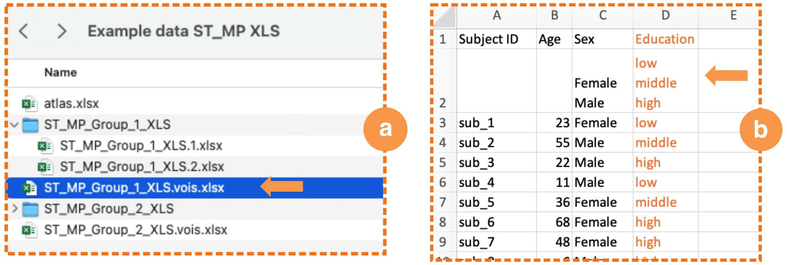

# Group of Subjects with Structural Multiplex Data

[](tut_gr_st.pdf)

For *structural multiplex data*, we will upload a folder containing the structural files from different modalities (layers) for different brain areas across subjects that belong to the same group. For example, the structural values could correspond to cortical thickness or gray matter volumes obtained from T1-weighted MRI data, brain perfusion in ASL, or abnormal protein deposition in static PET data. Then a connectivity matrix is computed using correlations in structural values between each pair of brain regions for each layer, and then the layers will be integrated in a multiplex graph. This Tutorial explains how to prepare and work with this kind of data.

> 
> 
> **Figure 1. GUI for a group of subjects with structural multiplex data.**
> Full graphical user interface to upload a group of subjects with structural multiplex data in BRAPH 2.0.

## Open the GUI

In most analyses, the group GUI is the second step after you have selected a brain atlas. You can open it by typing `braph2` in MatLab's terminal, which allows you to select a pipeline containing the steps required to perform your analysis and upload a brain atlas. After these steps have been completed you can upload your group's data, as shown in Figure 1.

> 
> 
> **Figure 2. Upload the data of a group of subjects.**
> Steps to upload a group of subjects with structural multiplex data using the GUI and an example dataset:
> **a** Open the group GUI.
> **b** Import the folder with the structural multiplex files in XLS or TXT format (see below for details on their format).
>	To upload the test structural multiplex data:
> **c-f** navigate to the BRAPH 2.0 folder `pipelines`, **d** `structural multiplex`, **e** `Example data ST_MP XLS`, and **f** select the folder with structural multiplex values of one group `ST_MP_Group_1_XLS`.

To open the GUI and upload the brain structural multiplex data, you can also do it from the command line (i.e., without opening an analysis pipeline) by typing the commands referenced below.

```matlab
gr = Group('SUB_CLASS', 'SubjectST_MP');  % creates a new object Group to use structural multiplex values for assessing connectivity i.e., SubjectST_MP.

gui = GUIElement('PE', gr);  % creates a GUI to upload the group data.
gui.get('DRAW');  % draws the GUI.
gui.get('SHOW');  % shows the GUI.
```
Moreover, if you don't have the `Example data ST_MP XLS` folder inside `structural multiplex`, then you can generate it by running the commands referenced below.

```matlab
test_ImporterGroupSubjectST_MP_XLS  % generates the example structural multiplex XLS data folder.
test_ImporterGroupSubjectST_MP_TXT  % generates the example structural multiplex TXT data folder.
```

## Visualize the Group Data

After completing the steps described in the Figure 2, you can see the data as shown in Figure 3a, and change the Group ID, name, and notes as in Figure 3b.

> 
> 
> **Figure 3. Edit the group metadata.** 
> **a** The GUI of the group's structural multiplex data.
> **b** The information you see on this GUI that can be changed. In this example, we have edited the ID, name, and notes of the group but can also change the subject's specific information.

## Visualize Each Subject's Data

Finally, you can open each subject's structural multiplex values by selecting the subject, right-click, and select "Open selection" as shown in Figure 4a, which shows the structural values from layer 1 in Figure 4b. Here, you can also change the subject's metadata (ID, label, notes), its variables of interest, and the structural multiplex values.

> 
> 
> **Figure 4. Edit the individual subject data.** 
> **a** Each subject's structural multiplex values can be opened by selecting the subject,  right-click, and select "Open selection".
> **b** In this subject GUI, it is possible to view and edit the metadata of the subject (ID, label, notes), its variables of interest (in this case, age and sex), and the structural multiplex values. 

## Preparation of the Data to be Imported

To be able to import structural multiplex data into BRAPH 2.0, you need to include the structural values of each layer for all subjects in a single file in excel or text format. All structural layers' files should be inside one group folder. Below you can see how this file should look like.

> 
>
> **Figure 5. Data preparation.**
> The data organization should follow this format:
> **a** The structural values of one layer from each subject belonging to the same group should be included in a single file (for example, ST_MP_Group_1_xlsx). 
> **b** This file should contain the subject's IDs, label and any relevant notes, followed by the structural values for each brain region belonging to a brain atlas. In this example, the (simulated) values correspond to the cortical thickness of 68 brain regions derived from T1-weighted MRI.
 
## Adding Covariates

When analyzing data, it's a common practice to incorporate *variables of interest*, which can be *covariates* or *correlates*. In BRAPH 2.0, these variables of interest should be included in a separate excel file placed just outside the group's folder . The file should share the group folder's name, but with a `.vois` extension, as shown in Figure 6a. The file must adhere to a specific format outlined in Figure 6b:

- **Subject IDs (column A).** Starting from row 3, column A should list the subject IDs.
  
- **Variables of interest (column B and subsequent columns).** Column B and the following columns should contain the variables of interest, one per column. Using this example, we see variables like "Age" and "Sex", along with an additional "Education" variable. For each column:
  - Row 1: The name of the variable of interest.
  - Row 2: Categories separated by a return (only for categorical variables of interest, like "Sex" and "Education").
  - Subsequent rows: The values of the variable of interest for each subject.

> 
>
> **Figure 6. Edit the Covariates.**
> The editable information in the Covariates file includes:
> **a** The names of the variables of interest (vois).
> **b** For categorical vois, you can specify the categories they belong to.

